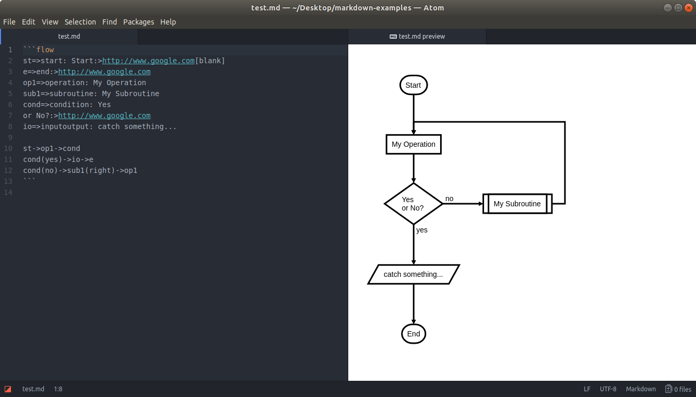
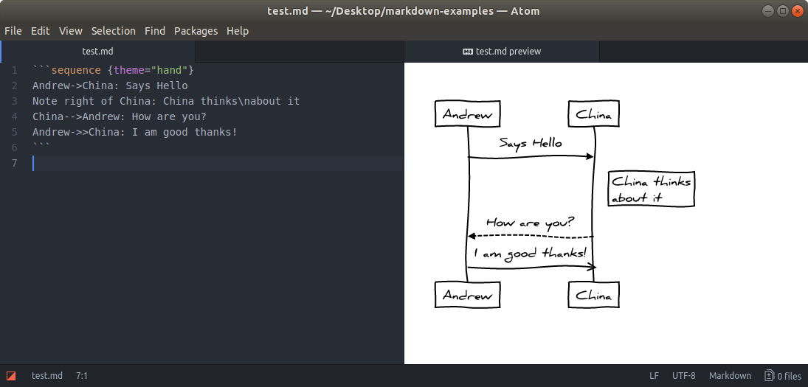
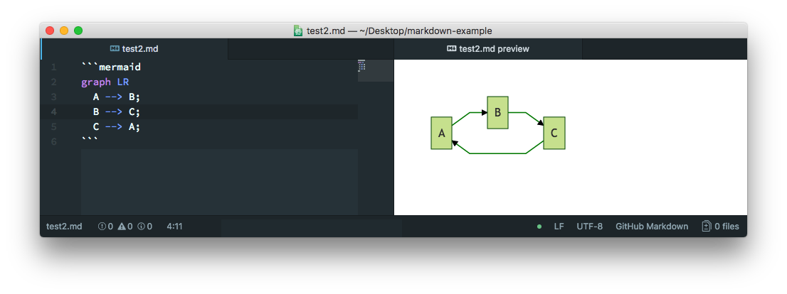
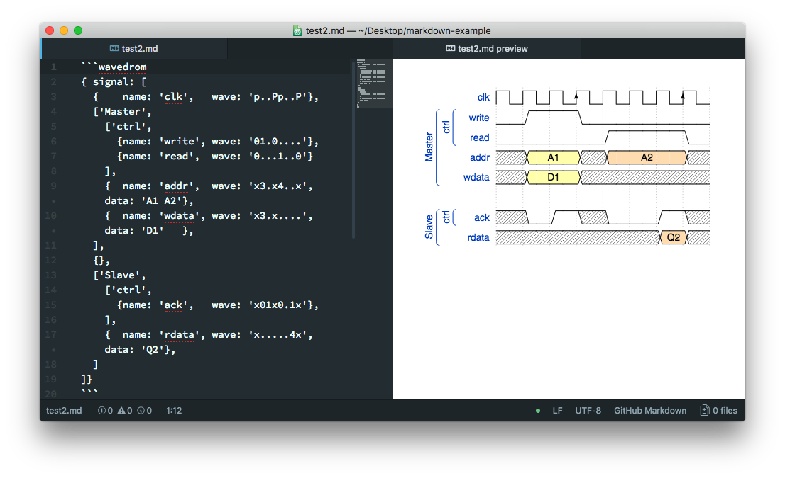
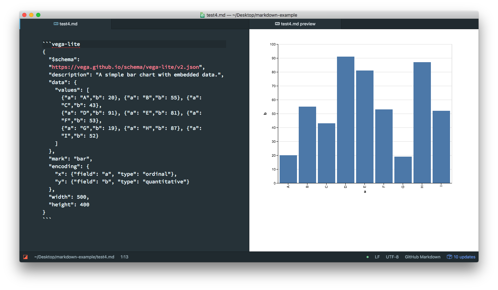
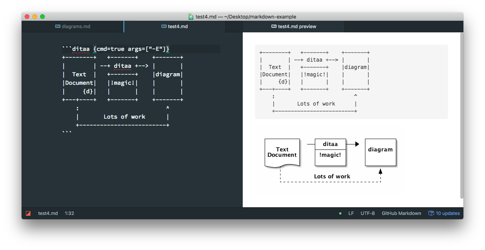

#图像

Markdown Preview Enhanced 内部支持 flow charts, sequence diagrams, mermaid, PlantUML, WaveDrom, GraphViz，Vega & Vega-lite，Ditaa 图像渲染。 你也可以通过使用 Code Chunk 来渲染 TikZ, Python Matplotlib, Plotly 等图像。

Please note that some diagrams doesn't work well with file export like PDF, pandoc, etc.

###Flow Charts
这一特性基于 flowchart.js。

* flow 代码快中的内容将会被 flowchart.js 渲染。



###Sequence Diagrams
这一特性基于 js-sequence-diagrams。

* sequence 代码快中的内容将会被 js-sequence-diagrams 渲染。
* 支持两个主题 simple（默认主题）和 hand。


###Mermaid
Markdown Preview Enhanced 使用 mermaid 来渲染流程图和时序图。

mermaid 代码块中的内容将会渲染 mermaid 图像。
查看 [mermaid 文档](http://knsv.github.io/mermaid/#flowcharts-basic-syntax) 了解更多如果创建图形。 

三个 mermaid 主题是支持的，并且你可以在 插件设置 中设置主题：

* mermaid.css
* mermaid.dark.css
* mermaid.forest.css 

你还可以通过 Markdown Preview Enhanced: Open Mermaid Config 命令打开 mermaid 配置文件。

###PlantUML
Markdown Preview Enhanced 使用 PlantUML 来创建各种图形。（**Java** 是需要先被安装好的）

你可以安装 Graphviz（非必需）来辅助生成各种各种图形。
puml 或者 plantuml 代码块中的内容将会被 PlantUML 渲染。

如果代码中 @start... 没有被找到，那么 @startuml ... @enduml 将会被自动添加。

###WaveDrom
Markdown Preview Enhanced 使用 [WaveDrom](https://github.com/drom/wavedrom) 来渲染 digital timing diagram.

wavedrom 代码块中的内容将会被 WaveDrom 渲染。


###GraphViz
Markdown Preview Enhanced 使用 Viz.js 来渲染 dot 语言 图形。

viz 或者 dot 代码块中的内容将会被 Viz.js 渲染。
你可以通过 {engine="..."} 来选择不同的渲染引擎。 引擎 circo，dot，neato，osage，或者 twopi 是被支持的。默认下，使用 dot 引擎。

###Vega 和 Vega-lite
Markdown Preview Enhanced 支持 [vega](https://vega.github.io/vega/) 以及 vega-lite 的静态图像.

vega 代码块中的内容将会被 vega 渲染。
vega-lite 代码块中的内容将会被 vega-lite 渲染。
JSON 以及 YAML 的输入是支持的。


你也可以 @import 一个 JSON 或者 YAML 文件作为 vega 图像，例如：

```markdown
@import "your_vega_source.json" {as="vega"}
@import "your_vega_lite_source.json" {as="vega-lite"}
```
###Ditaa
Markdown Preview Enhanced 支持 [ditaa](https://github.com/stathissideris/ditaa)。

(Java 是需要先被安装好的)

ditaa 整合于 [code chunk](https://shd101wyy.github.io/markdown-preview-enhanced/#/zh-cn/code-chunk), for example:

  ```ditaa {cmd=true args=["-E"]}
  +--------+   +-------+    +-------+
  |        | --+ ditaa +--> |       |
  |  Text  |   +-------+    |diagram|
  |Document|   |!magic!|    |       |
  |     {d}|   |       |    |       |
  +---+----+   +-------+    +-------+
      :                         ^
      |       Lots of work      |
      +-------------------------+
  ```
>shift-enter 来运行 code chunk。 设置 {hide=true} 来隐藏代码块。 设置 {run_on_save=true} 启动当文件保存时，渲染 ditaa 图像。



如果你只是想要显示代码块而不想画图，则只要在后面添加 {code_block=true} 即可：

```markdown

    ```mermaid {code_block=true}
    // 你的 mermaid 代码
    ```
```

你可以为图像的容器添加属性。 例如：

```markdown
    ```puml {align="center"}
    a->b
    ```
```
```puml {align="center"}
    a->b
```

将会把 puml 的图像放在中间。

当你保存你的 markdown 文件到 GFM Markdown 时， 所有图像将会被保存为 png 文件到 imageFolderPath 文件夹。 你可以设置导出文件的文件名 {filename="图片.png"}。

例如：
```markdown
    ```mermaid {filename="我的mermaid.png"}
    ...
    ```
```
